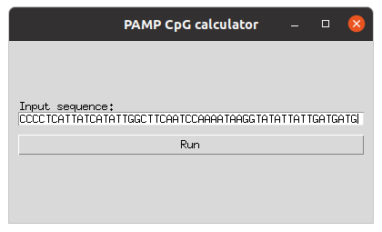

# PAMP CpG calculator

Identifies pathogen-associated molecular patterns specifically by CpG divergence from the expected. This is an open source implementation of the work outlined by [Wright, JF (2020)](https://www.ncbi.nlm.nih.gov/pmc/articles/PMC7403467/) for viruses/rAAV against hg38.

## GUI usage

To open the program, you will still need to open via command line.

```
python PAMP_CpG_calc_GUI.py
```

Paste the entire sequence into the input box. *Note: may require `ctrl-v`, as right click may not work.*



Then after pressing `Run`, the output will be displayed on a second window.


## Command line usage

The program takes in a single sequence file, no header. It assumes a single contig. *The program does not expect a FASTA format file.*

```
usage: PAMP_CpG_calc.py [-h] SEQUENCE_FILE

PAMP CpG calculator. For more details, see: Wright JF. Quantification of CpG 
Motifs in rAAV Genomes: Avoiding the Toll. Mol Ther. 2020;28(8):1756-1758. 
doi:10.1016/j.ymthe.2020.07.006

positional arguments:
  SEQUENCE_FILE  sequence of interest

optional arguments:
  -h, --help     show this help message and exit
```

## Future features

Please leave an issue if you would like to see features added.